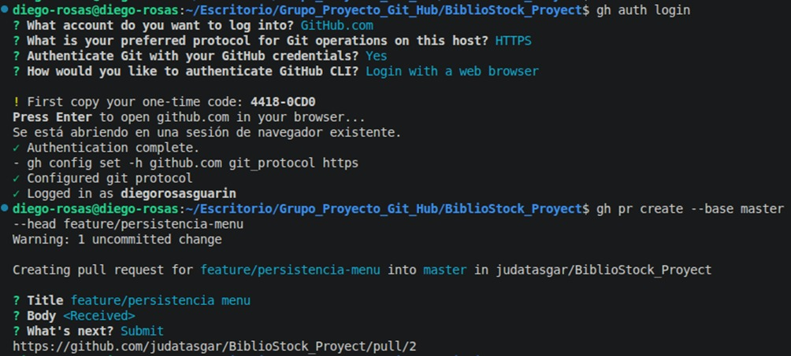
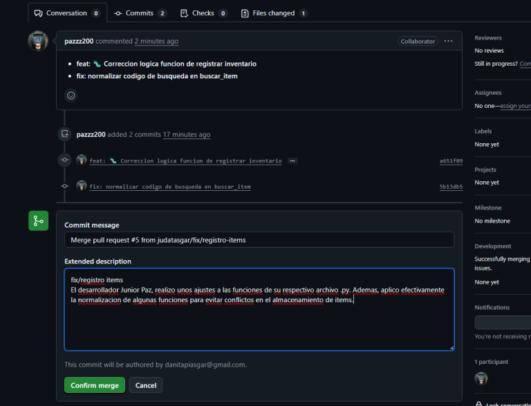
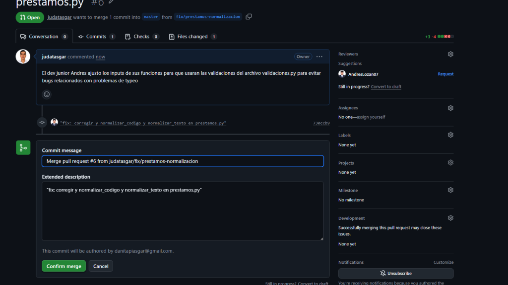
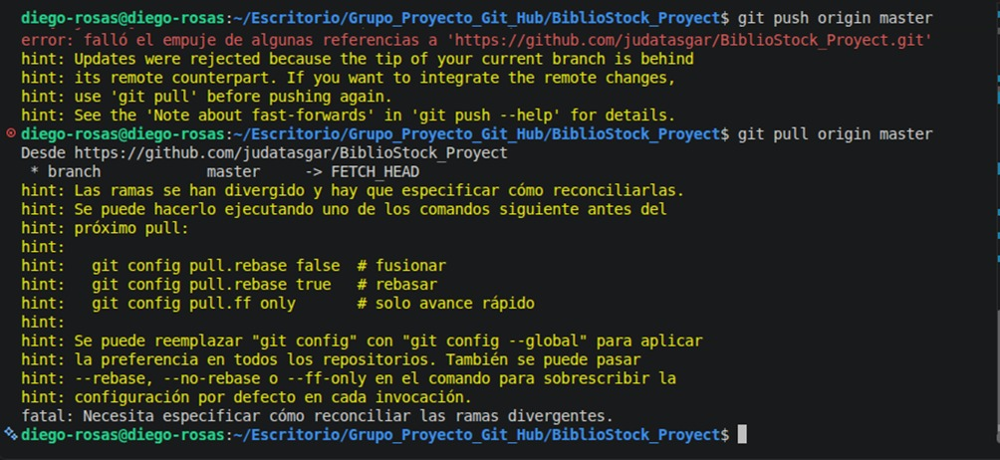
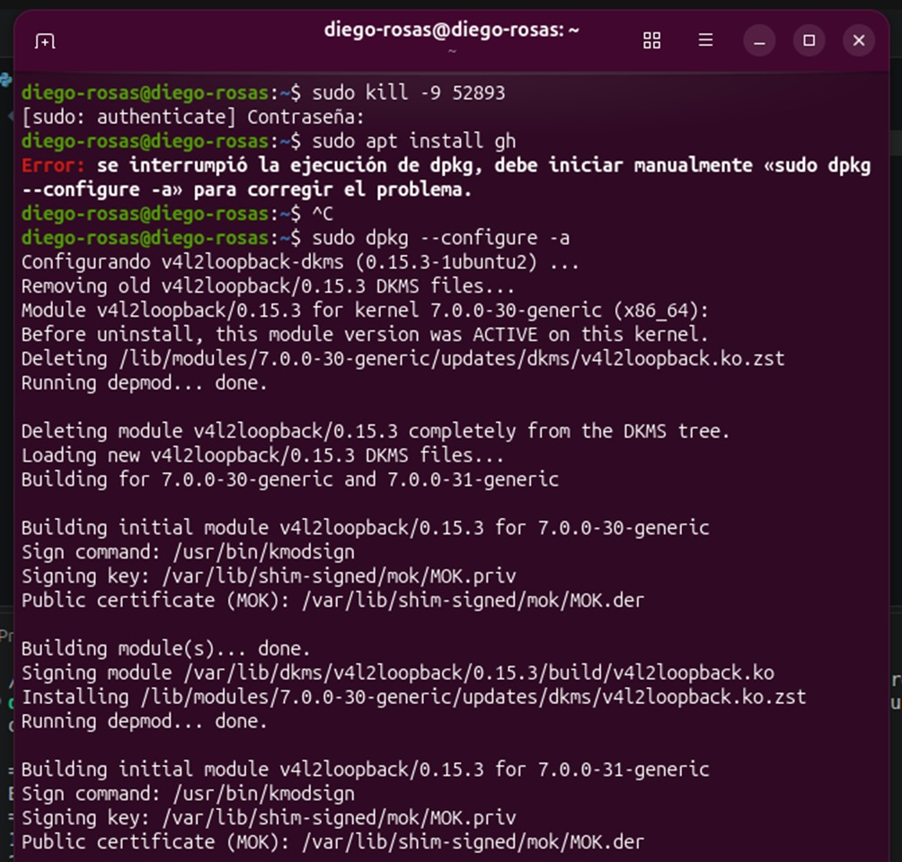

# BiblioStock - Gestión de Inventarios 📚

Proyecto final para la materia/módulo de programación. Es un sistema CLI en Python para gestionar el inventario y los préstamos de la **Biblioteca Horizonte**. Permite registrar y buscar libros/ítems, llevar el control de préstamos y devoluciones, y guarda todo en archivos JSON para no perder la información al cerrar el programa.

---

## 🛠️ ¿Cómo está organizado el proyecto?

Dividimos el código en varios archivos para no tener todo amotonado en un solo `main`:

* **`main.py`**: Es el punto de entrada. Muestra el menú en consola y llama a las funciones según lo que elija el usuario.
* **`inventario.py`**: Toda la lógica para agregar ítems, ver la lista completa y hacer búsquedas.
* **`prestamos.py`**: Maneja el registro de cuándo alguien se lleva un libro y cuándo lo devuelve.
* **`persistencia.py`**: Se encarga de leer y escribir los datos en los archivos JSON (`inventario.json` y `prestamos.json`).
* **`validaciones.py`**: Funciones ayuda para limpiar y validar lo que escribe el usuario por consola (para que no metan números negativos o creen duplicados por escribir en minúsculas).
* **`inventario.json` / `prestamos.json`**: Las bases de datos en formato JSON donde se guarda la información.

---

## ⚙️ Funcionalidades del sistema

1. **Registrar ítem:** Pide los datos de un nuevo libro o material (código, título, autor, categoría, ubicación y cantidad) y lo añade al inventario.
2. **Listar ítems:** Muestra en pantalla todo lo que hay guardado en la biblioteca.
3. **Buscar ítem:** Permite buscar un libro ingresando su código.
4. **Registrar préstamo:** Descuenta una unidad del inventario y guarda a quién se le prestó.
5. **Registrar devolución:** Marca el préstamo como devuelto y regresa la unidad al inventario.
6. **Salir:** Guarda los cambios realizados en los JSON y cierra la aplicación.

---

## 🧩 Detalles importantes de la implementación

### Validaciones (`validaciones.py`)
Para evitar problemas con los datos que ingresa el usuario:
* Usamos una función para quitar tildes y limpiar espacios de más.
* `normalizar_texto`: Pasa los nombres y títulos a formato tipo título (ejemplo: "cien años de soledad" -> "Cien Años De Soledad") y revisa que no exista ya en la lista para evitar duplicados.
* `normalizar_codigo`: Le da formato estándar a los códigos (por ejemplo, si escriben `ab1` lo pasa a `AB-001`).
* `pedir_entero_positivo`: Se queda en un bucle pidiendo el dato hasta que la persona ingrese un número entero mayor a 0.

*(Decidimos dejar `normalizar_texto` y `normalizar_codigo` separadas porque procesan cosas distintas).*

### Persistencia (`persistencia.py`)
Maneja la carga y guardado de archivos. Si el archivo JSON no existe todavía o está vacío, simplemente devuelve una lista vacía para que el programa no se rompa al iniciar. Usamos `ensure_ascii=False` para que las tildes y las letras **ñ** se guarden bien.

---

## 👥 Equipo de trabajo

* **Daniel (`judatasgar`)** — Integrador / Revisor de `validaciones.py` y encargado de revisar los Pull Requests.
* **Paz (`pazzz200`)** — Encargada del módulo de inventario (`inventario.py`).
* **Andrés (`AndresLozan07`)** — Encargado de la lógica de préstamos y devoluciones (`prestamos.py`).
* **Frank (`diegorosasguarin`)** — Encargado de la persistencia de datos, el menú principal y la documentación.

---

## 🔀 Flujo de Git y trabajo en equipo

Trabajamos con el flujo clásico de ramas por funcionalidad (`feature/...`, `fix/...`, `docs/...`) y abrimos Pull Requests hacia la rama `master` para que Daniel los revisara antes de hacer el merge.

**Historial de Pull Requests integrados:**
1. PR #1 (`feature/registro-inventario`): Primera versión de la lógica de inventario.
2. PR #2 (`feature/persistencia-menu`): Estructura del menú y funciones de lectura/escritura en JSON.
3. PR #3 (`feature/creacion-gestion-inventario`): Ajustes finales en las funciones de buscar y listar.
4. PR #4 (`feature/prestamos`): Lógica para préstamos y devoluciones.
5. PR #5 (`fix/registro-items`): Corrección de errores al registrar y buscar ítems.
6. PR #6 (`fix/prestamos-normalizacion`): Corrección en los parámetros pasados a las funciones de validación.

### ⚠️ Ejemplo de conflicto de merge (Prueba en clase)

Hicimos una prueba a propósito para simular un conflicto editando dos cambios al mismo tiempo sobre el título del menú en `main.py`:

* Creamos las ramas `demo/menu-titulo-v1` y `demo/menu-titulo-v2` desde el mismo commit.
* Ambas cambiaron la línea donde se imprime el encabezado del menú por textos distintos.
* Al mergear la `v1` entró sin problemas, pero al intentar mergear la `v2` Git nos sacó el mensaje de conflicto:

```python
<<<<<<< HEAD
    print("BIBLIOSTOCK CLI - SISTEMA DE BIBLIOTECA HORIZONTE")
=======
    print("=== BIBLIOSTOCK - GESTION DE BIBLIOTECA ===")
>>>>>>> demo/menu-titulo-v2


---

## 📸 Evidencias y capturas

A continuación se presentan las capturas del proceso de desarrollo, manejo de Pull Requests y solución de errores en Git:

### Flujo y gestión de Pull Requests







---

### Solución de errores y pruebas en Git






